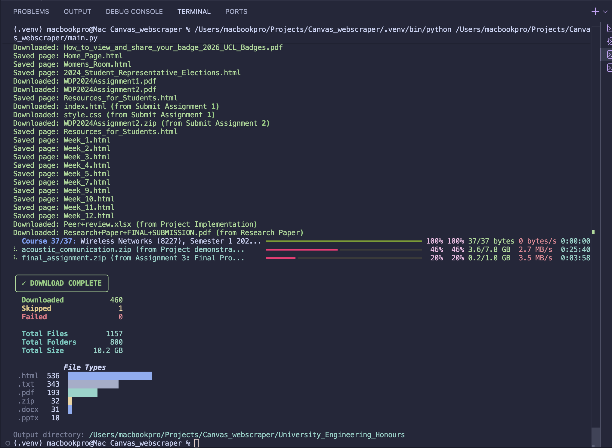

# Canvas LMS Scraper

A Python tool to download all your course content from Canvas LMS, including assignments, files, pages, discussions, and submissions.



## Features

- Downloads all course modules and content
- Saves assignments with descriptions, grades, and your submissions
- Downloads quizzes with questions and your scores
- Captures discussion posts and replies
- Organizes content into a clean folder structure
- Resume mode to skip already-downloaded files
- Progress bar with download speeds and time remaining
- Retry logic for failed downloads

## Installation

1. **Clone this repository**
   ```bash
   git clone https://github.com/AaronHassanRobinson/canvas-webscraper.git
   cd canvas-webscraper
   ```

2. **Create a virtual environment**
   ```bash
   python -m venv .venv

   # On macOS/Linux:
   source .venv/bin/activate

   # On Windows:
   .venv\Scripts\activate
   ```

3. **Install dependencies**
   ```bash
   pip install -r requirements.txt
   ```

## Setup

### Getting Your Canvas API Key

1. Log into your Canvas account
2. Go to **Account** > **Settings**
3. Scroll down to **Approved Integrations**
4. Click **+ New Access Token**
5. Give it a name (e.g., "Course Scraper") and set an expiry date
6. Copy the generated token 

### Configuration

1. Copy the example config file:
   ```bash
   cp canvas_credentials.example.txt canvas_credentials.txt
   ```

2. Edit `canvas_credentials.txt` with your details:
   ```
   API_URL=https://your-university.instructure.com
   API_KEY=your_api_key_here
   DOWNLOAD_DIR=my_courses
   ```

## Usage

**Basic usage (resume mode - skips existing files):**
```bash
python canvas_scraper.py
```

**Force redownload all files:**
```bash
python canvas_scraper.py --force
```

**Use a custom config file:**
```bash
python canvas_scraper.py -c my_config.txt
```

**Pass credentials via command line:**
```bash
python canvas_scraper.py --url https://canvas.edu --key YOUR_API_KEY --output downloads
```

## Command Line Options

| Option | Description |
|--------|-------------|
| `-c, --config` | Path to config file (default: `canvas_credentials.txt`) |
| `-u, --url` | Canvas API URL |
| `-k, --key` | Canvas API key |
| `-o, --output` | Output directory for downloads |
| `-r, --resume` | Skip existing files (default) |
| `-f, --force` | Force redownload all files |

## Output Structure

```
output_folder/
├── Course_Name/
│   ├── Module_Name/
│   │   ├── Page_Title.html
│   │   ├── lecture_slides.pdf
│   │   ├── Assignment_Name/
│   │   │   ├── assignment_description.html
│   │   │   ├── my_submission.txt
│   │   │   └── submitted_file.pdf
│   │   ├── Quiz_Name/
│   │   │   ├── quiz_info.html
│   │   │   ├── quiz_questions.html
│   │   │   └── my_submission.html
│   │   └── Discussion_Topic.html
│   └── ASSIGNMENTS/
│       └── ...
└── Another_Course/
    └── ...
```

## Content Types Downloaded

- **Pages** - Saved as HTML files
- **Files** - PDFs, documents, images, etc.
- **Assignments** - Description, due date, points, your submission and grade
- **Quizzes** - Quiz info, questions (if accessible), and your score
- **Discussions** - Topic and all replies
- **External URLs** - Saved as text files with the link

## Troubleshooting

**"Error connecting to Canvas"**
- Check your API_URL is correct (no trailing slash)
- Verify your API key is valid and hasn't expired

**"Missing required config values"**
- Make sure your `canvas_credentials.txt` has all three required fields

**Downloads failing repeatedly**
- Check your internet connection
- Some files may be restricted or deleted from Canvas

## License

MIT License - feel free to use and modify.
